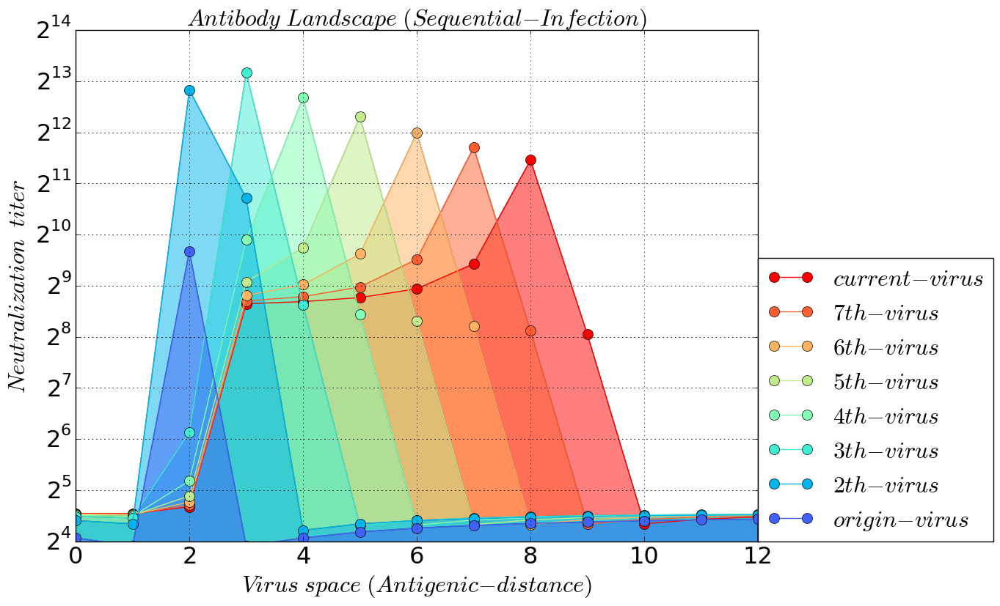
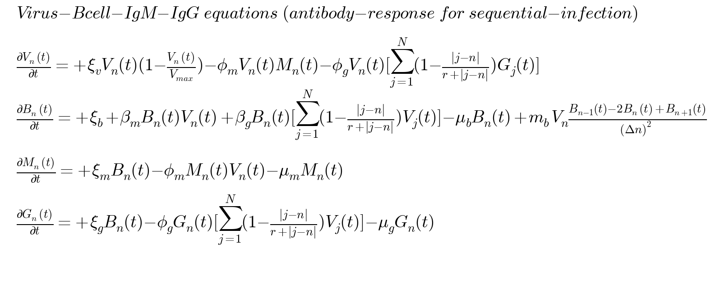
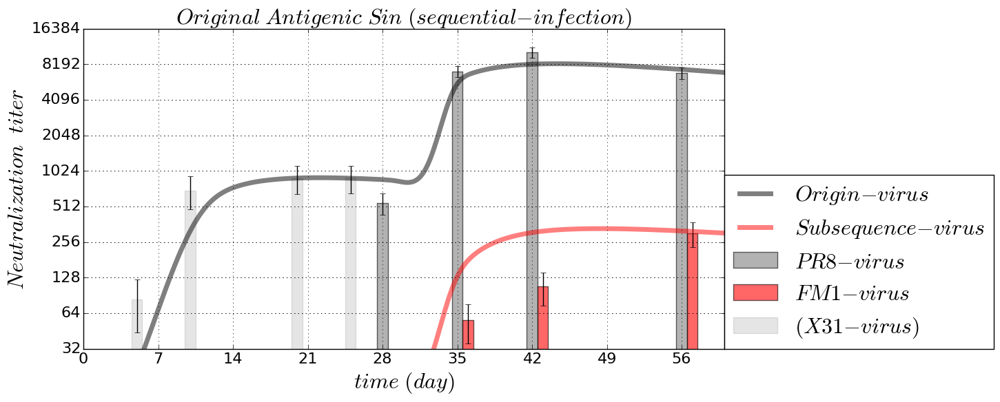

# antibody-response-pulse
Model of cross-reactive antibody response from B cells after influenza virus infection or vaccination

### [antibody landscape --- from sequential infection ](https://github.com/blab/antibody-response-pulse/blob/master/code/VBMG_infection_landscape.ipynb)

### [antibody landscape --- from sequential vaccination ](https://github.com/blab/antibody-response-pulse/blob/master/code/VBMG_vaccination_landscape.ipynb)

### [Virus-Bcell-IgM-IgG Model --- Bcell mutation and IgG cross-immunity ](https://github.com/blab/antibody-response-pulse/blob/master/code/VBMG_infection_landscape.ipynb)

### [original antigenic sin --- from sequential infection ](https://github.com/blab/antibody-response-pulse/blob/master/code/VBMG_infection_OAS.ipynb)

### [original antigenic sin --- from sequential vaccination ](https://github.com/blab/antibody-response-pulse/blob/master/code/VBMG_vaccinationn_OAS.ipynb)

### [antibody response --- from repeated infections ](https://github.com/blab/antibody-response-pulse/blob/master/bcell-array/code/IgM_IgG_repeated_infection.ipynb)

### [antibody response --- primary vaccination ](https://github.com/blab/antibody-response-pulse/blob/master/bcell-array/code/VBMG_vaccination_1st.ipynb)

### [antibody response --- primary infection ](https://github.com/blab/antibody-response-pulse/blob/master/bcell-array/code/VBMG_infection_1st.ipynb)

### [antibody response for repeated infections --- Antibody-Bcell-Tcell-Virus-model model](https://github.com/blab/antibody-response-pulse/blob/master/bcell-array/code/Antibody_Bcell_Tcell_Virus_model.ipynb)

